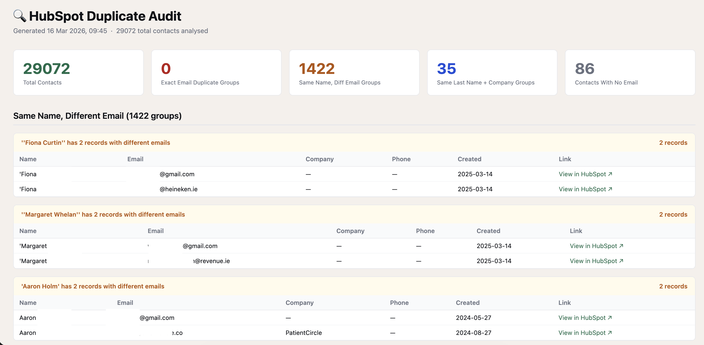

# HubSpot Duplicate Contact Audit

No more manually hunting for duplicates. This script pulls your entire HubSpot contact database via API, runs three types of duplicate detection, and generates a full report in one run.

Output: a self-contained HTML dashboard + Excel file with every flagged duplicate, direct links to each record in HubSpot, and a full list of contacts missing an email.

Built and tested on a 29,000+ contact database.

---

## Preview



---

## What it detects

- **Exact email match** — same email address on two or more records
- **Same name, different email** — same person entered twice with a different email (typo, personal vs work, etc.)
- **Same last name + company** — catches duplicates where the name format differs but the person is the same

Also flags all contacts with no email address at all.

---

## Stack

Python · HubSpot CRM API · Pandas · Jinja2 · OpenPyXL

---

## Setup

**Install dependencies**
```bash
pip3 install requests pandas openpyxl jinja2
```

**HubSpot Private App**
- Go to HubSpot → Settings → Integrations → Private Apps → Create a private app
- Add scope: `crm.objects.contacts.read`
- Copy the token

**Configure**
```python
# config.py
HUBSPOT_TOKEN = "your_token_here"
```

**Run**
```bash
python3 hubspot_duplicate_audit.py
```

---

## Output files

- `hubspot_duplicate_audit.html` — visual report with scorecards, duplicate groups, and links directly into HubSpot
- `hubspot_duplicate_audit.xlsx` — 3 sheets: Summary, All Duplicates, No Email contacts
